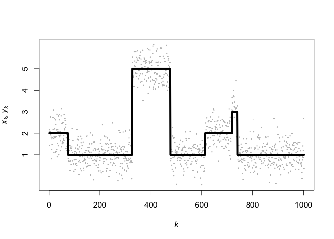
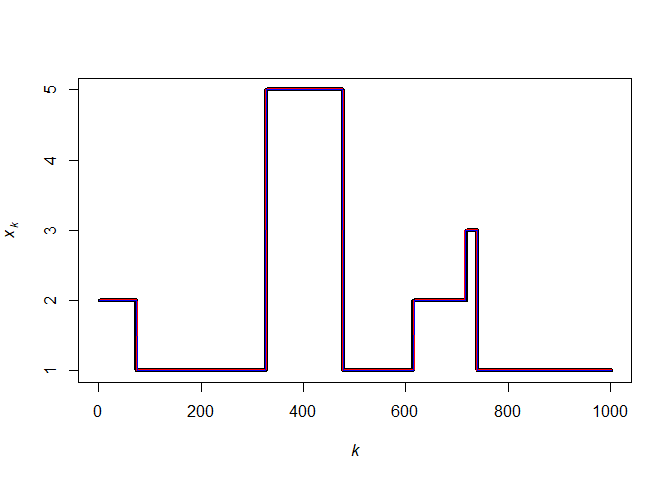

<!-- README.md is generated from README.Rmd. Please edit that file -->

# QATS

<!-- badges: start -->
<!-- badges: end -->

In hidden Markov models (HMM), one observes a noisy version of an
unobservable finite-state Markov chain. One of the main components of
HMM is to decode that signal, that is to estimate the sequence of hidden
states at the origin of the observation sequence. Existing decoding
algorithms such as [Viterbi
(1967)](https://doi.org/10.1109/TIT.1967.1054010) algorithm have
computational complexity at best linear in the size of the observed
sequence, and sub-quadratic in the size of the state space.

Assuming that the observation sequence is stored as specific cumulative
sums, we present Quick Adaptive Ternary Segmentation (QATS), a procedure
which decodes the hidden sequence in polylogarithmic computational
complexity in the size of the sequence, and cubic in the size of the
state space. In essence, the estimated sequence of states sequentially
maximizes local likelihood scores among all local paths with at most
three segments. The latter search is performed only approximately using
an adaptive search procedure. The resulting sequence is admissible in
the sense that all transitions occur with positive probability.

QATS and Viterbi algorithm, as well as algorithms to compute the
generalized risk-based estimator of [Lember and Koloydenko
(2014)](https://dl.acm.org/doi/10.5555/2627435.2627436) and the
K-segment approach of [Titsias, Holmes and Yau
(2016)](https://doi.org/10.1080/01621459.2014.998762) are implemented in
both **R** and **C++**.

## Installation

You can install the development version of **QATS** from
[GitHub](https://github.com/) with:

``` r
install.packages("devtools")
devtools::install_github("AlexandreMoesching/QATS")
```

## Usage

This is a basic example which shows how to solve a common problem:

``` r
# Load package
library(QATS)

# Set any seed, just for the example...
set.seed(123)

# Cardinality of the space of hidden states
m <- 5

# Standard deviation of the normal emission distributions
sigma <- 0.5

# Size of the observation sequence
n <- 1e3 + 1

# Expected number of change points
K <- 7

# Generate a sequence
par <- sample.HMM(
  n = n, m = m, K = K,
  emi.dist = "normal",
  emi.param = list(sigma = sigma)
)

# Extract the hidden (xx.0) and observed (yy) sequences
xx.0 <- par$xx
yy <- par$yy

# Actual number of change points of the generated sequence:
sum(diff(xx.0) != 0)
#> [1] 6
```

The function `sample.HMM()` already pre-computes useful quantities for
later such as the log-probability transition matrix, log-initial
distribution, densities and log-densities evaluated at the observations,
cumulative sums of log-densities, etc. The list of parameters will then
be passed to the different functions.

We can now plot the generated hidden sequence (black line) and
observations (grey points):

``` r
display.result(xx.0, par = par, yy = yy)
```



To use Viterbi algorithm in order to estimate the hidden sequence,
simply do:

``` r
res <- Viterbi.CPP(par)
xx.1 <- res$xx
(tt <- as.vector(res$time)) # Time in seconds
#> [1] 8.36e-05
```

To use QATS, run:

``` r
res <- QATS.CPP(par)
xx.2 <- res$xx
(tt <- as.vector(res$time)) # Time in seconds
#> [1] 0.0018605
```

Here is a plot of the true path (black), Viterbi-path (blue) and
QATS-path (red):

``` r
display.result(xx.0, xx.1, xx.2, par)
```



The following line shows that Viterbi and QATS produce the same path,
and that both did not estimate correctly 5 states out of the 1001.

``` r
c(sum(xx.0 != xx.1), sum(xx.1 != xx.2))
#> [1] 5 0
```

## Comparison of QATS, Viterbi, risk-based estimators and K-segmentation

``` r
# Set a larger observation sequence, the other parameters remain unchanged
n <- 1e6 + 1

# Generate a sequence
par <- sample.HMM(
  n = n, m = m, K = K,
  emi.dist = "normal",
  emi.param = list(sigma = sigma)
)
xx.0 <- par$xx
sum(diff(xx.0) != 0)
#> [1] 7

# 1. Viterbi
res <- Viterbi.CPP(par)
xx <- matrix(res$xx, nrow = 1)
tt <- as.vector(res$time)
rownames(xx)[1] <- names(tt)[1] <- "Viterbi"

# 2. Mointwise MAP
res <- G_classifier.CPP(par, 1, 0, 0, 0)
xx <- rbind(xx, res$xx)
tt <- c(tt, as.vector(res$time))
rownames(xx)[length(tt)] <- names(tt)[length(tt)] <- "pMAP"

# 3. Maximum prior probability
res <- G_classifier.CPP(par, 0, 0, 0, 1)
xx <- rbind(xx, res$xx)
tt <- c(tt, as.vector(res$time))
rownames(xx)[length(tt)] <- names(tt)[length(tt)] <- "MPP"

# 4. Marginal prior mode
res <- G_classifier.CPP(par, 0, 0, 1, 0)
xx <- rbind(xx, res$xx)
tt <- c(tt, as.vector(res$time))
rownames(xx)[length(tt)] <- names(tt)[length(tt)] <- "MPM"

# 5. Generalized Viterbi
res <- G_classifier.CPP(par, 0, 1, 0, 1)
xx <- rbind(xx, res$xx)
tt <- c(tt, as.vector(res$time))
rownames(xx)[length(tt)] <- names(tt)[length(tt)] <- "gViterbi"

# 6. K-segmentation
K_max <- K + 4
res <- K_segmentation.CPP(par, K_max)
xx <- rbind(xx, res$xx)
tt <- c(tt, rep(as.vector(res$time), K_max))
rownames(xx)[length(tt) - ((K_max - 1):0)] <-
  names(tt)[length(tt) - ((K_max - 1):0)] <-
  paste(rep("K-seg", K_max), 1:K_max)

# 7. QATS
res <- QATS.CPP(par)
xx <- rbind(xx, res$xx)
tt <- c(tt, as.vector(res$time))
rownames(xx)[length(tt)] <- names(tt)[length(tt)] <- "QATS"

# Compute errors
n.estim <- nrow(xx)
fit_eval <- matrix(0, nrow = n.estim, ncol = 4)
colnames(fit_eval) <- c("l0", "l1", "l2", "V-Measure")

for (w in 1:n.estim) {
  fit_eval[w, 1] <- lp_norm(xx.0, xx[w, ], 0)
  fit_eval[w, 2] <- lp_norm(xx.0, xx[w, ], 1)
  fit_eval[w, 3] <- lp_norm(xx.0, xx[w, ], 2)
  fit_eval[w, 4] <- V_measure(xx.0, xx[w, ])
}
rownames(fit_eval) <- names(tt)

cbind(fit_eval, tt)
#>                    l0           l1           l2 V-Measure        tt
#> Viterbi  8.999991e-06 8.999991e-06 2.999997e-06 0.9999096 0.0782033
#> pMAP     3.999996e-06 3.999996e-06 1.999998e-06 0.9999569 0.4723260
#> MPP      6.677853e-01 1.899364e+00 2.367604e-03 0.0000000 0.3604181
#> MPM      6.677853e-01 1.899364e+00 2.367604e-03 0.0000000 0.3162012
#> gViterbi 8.999991e-06 8.999991e-06 2.999997e-06 0.9999096 0.3219979
#> K-seg 1  8.382852e-01 1.228223e+00 1.417073e-03 0.0000000 1.4680419
#> K-seg 2  6.499274e-01 8.515071e-01 1.120119e-03 0.3074565 1.4680419
#> K-seg 3  2.194378e-01 2.194378e-01 4.684416e-04 0.6983234 1.4680419
#> K-seg 4  2.007808e-01 2.007808e-01 4.480855e-04 0.7183576 1.4680419
#> K-seg 5  5.772594e-02 5.772594e-02 2.402621e-04 0.9179647 1.4680419
#> K-seg 6  3.906896e-02 3.906896e-02 1.976586e-04 0.9240398 1.4680419
#> K-seg 7  1.866598e-02 1.866598e-02 1.366234e-04 0.9506571 1.4680419
#> K-seg 8  8.999991e-06 8.999991e-06 2.999997e-06 0.9999096 1.4680419
#> K-seg 9  9.999990e-06 9.999990e-06 3.162274e-06 0.9999009 1.4680419
#> K-seg 10 1.599998e-05 1.599998e-05 3.999996e-06 0.9998513 1.4680419
#> K-seg 11 1.899998e-05 1.899998e-05 4.358895e-06 0.9998199 1.4680419
#> QATS     3.906896e-02 3.906896e-02 1.976586e-04 0.9240398 0.0048281
```

## Step-by-step computation of QATS

For that, make sure that the sample size is not too large ($n < 10^3$).

``` r
set.seed(1234)
n <- 3e2 + 1
par <- sample.HMM(
  n = n, m = m, K = K,
  emi.dist = "normal",
  emi.param = list(sigma = sigma)
)
res.Vit <- Viterbi.CPP(par)
res.QATS <- QATS.display(par$xx, res.Vit$xx, par)
```
