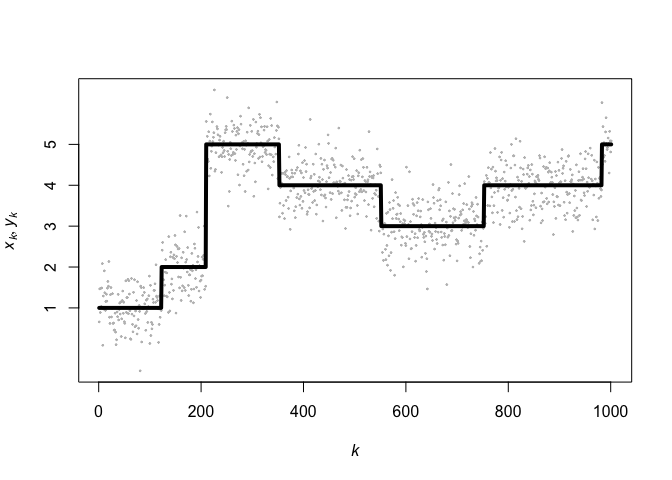
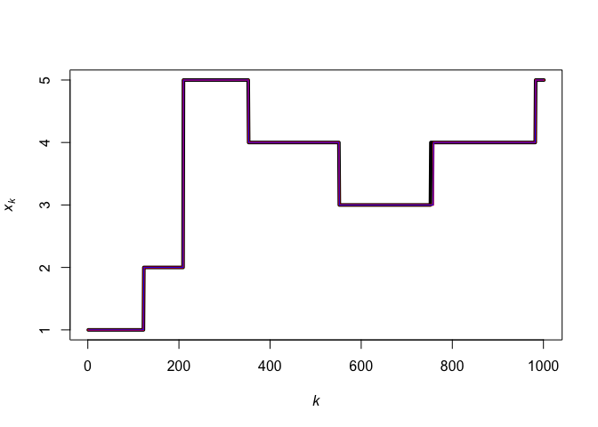

<!-- README.md is generated from README.Rmd. Please edit that file -->

# QATS

<!-- badges: start -->

<!-- badges: end -->

**QATS** (Quick Adaptive Ternary Segmentation) is an R package for
decoding hidden Markov models (HMMs) in polylogarithmic time in the
sequence length and cubic time in the number of states.

Classical decoders like the Viterbi algorithm run in $O(nm^2)$ time,
which becomes a bottleneck for long sequences. QATS achieves
$O(m^3 \log^2 n)$ complexity by combining a divide-and-conquer strategy
with an adaptive ternary segmentation step, making it orders of
magnitude faster on long sequences while producing near-identical
decoded paths.

> Moesching, A., Li, H. and Munk, A. (2025). Quick Adaptive Ternary
> Segmentation for decoding hidden Markov models. *Journal of
> Computational and Graphical Statistics*.
> [doi:10.1080/10618600.2025.2467654](https://doi.org/10.1080/10618600.2025.2467654)

The package also provides C++ implementations of the Viterbi algorithm,
pointwise MAP (PMAP), the generalized risk-based classifier of [Lember
and Koloydenko (2014)](https://dl.acm.org/doi/10.5555/2627435.2627436),
and the K-segmentation approach of [Titsias, Holmes and Yau
(2016)](https://doi.org/10.1080/01621459.2014.998762).

## Installation

Install from GitHub with:

``` r
# install.packages("devtools")
devtools::install_github("AlexandreMoesching/QATS")
```

## Quick start

``` r
library(QATS)
set.seed(123)

# Model parameters
m <- 5                       # number of hidden states
mu <- 1:m                    # emission means
sigma <- rep(0.5, m)         # emission std devs
n <- 1e3 + 1                 # sequence length
K <- 7                       # expected number of change points

# Simulate an HMM
par <- sample.HMM(
  n = n, m = m, K = K,
  emi.dist = "normal",
  emi.param = list(mu = mu, sigma = sigma)
)
xx.0 <- par$xx               # true hidden states
yy   <- par$yy               # observations

# Actual number of change points
sum(diff(xx.0) != 0)
#> [1] 6
```

`sample.HMM()` returns a parameter list containing the log-transition
matrix, log-initial distribution, emission (log-)densities, and their
cumulative sums. This list is passed directly to the decoding functions.

### Visualising the HMM

``` r
display.result(xx.0, par = par, yy = yy)
```



### Decoding

``` r
# Viterbi
res <- Viterbi.CPP(par)
xx.1 <- res$xx
(tt <- as.vector(res$time)) # seconds
#> [1] 1.5125e-05
```

``` r
# PMAP
res <- PMAP.CPP(par)
xx.1.PMAP <- res$xx
(tt <- as.vector(res$time))
#> [1] 3.9708e-05
```

``` r
# QATS
res <- QATS.CPP(par)
xx.2 <- res$xx
(tt <- as.vector(res$time))
#> [1] 0.000137209
```

True path (black), Viterbi (blue), QATS (red):

``` r
display.result(xx.0, xx.1, xx.2, par)
```



Viterbi and QATS produce the same path here, and both misclassify only a
handful of states:

``` r
c(sum(xx.0 != xx.1), sum(xx.1 != xx.1.PMAP), sum(xx.1 != xx.2))
#> [1] 6 2 0
```

## Benchmark: all decoders on a long sequence

The advantage of QATS becomes clear on longer sequences. Below, we
decode a sequence of length $10^6$ and compare accuracy and runtime
across all implemented methods.

``` r
n <- 1e6 + 1

par <- sample.HMM(
  n = n, m = m, K = K,
  emi.dist = "normal",
  emi.param = list(mu = mu, sigma = sigma)
)
xx.0 <- par$xx
sum(diff(xx.0) != 0)
#> [1] 12

# 1. Viterbi
res <- Viterbi.CPP(par)
xx <- matrix(res$xx, nrow = 1)
tt <- as.vector(res$time)
rownames(xx)[1] <- names(tt)[1] <- "Viterbi"

# 2. Pointwise MAP - manual
res <- PMAP.CPP(par)
xx <- rbind(xx, res$xx)
tt <- c(tt, as.vector(res$time))
rownames(xx)[length(tt)] <- names(tt)[length(tt)] <- "pMAP-man"

# 3. Pointwise MAP
res <- G_classifier.CPP(par, 1, 0, 0, 0)
xx <- rbind(xx, res$xx)
tt <- c(tt, as.vector(res$time))
rownames(xx)[length(tt)] <- names(tt)[length(tt)] <- "pMAP"

# 4. Maximum prior probability
res <- G_classifier.CPP(par, 0, 0, 0, 1)
xx <- rbind(xx, res$xx)
tt <- c(tt, as.vector(res$time))
rownames(xx)[length(tt)] <- names(tt)[length(tt)] <- "MPP"

# 5. Marginal prior mode
res <- G_classifier.CPP(par, 0, 0, 1, 0)
xx <- rbind(xx, res$xx)
tt <- c(tt, as.vector(res$time))
rownames(xx)[length(tt)] <- names(tt)[length(tt)] <- "MPM"

# 6. Generalized Viterbi
res <- G_classifier.CPP(par, 0, 1, 0, 1)
xx <- rbind(xx, res$xx)
tt <- c(tt, as.vector(res$time))
rownames(xx)[length(tt)] <- names(tt)[length(tt)] <- "gViterbi"

# 7. K-segmentation
K_max <- K + 4
res <- K_segmentation.CPP(par, K_max)
xx <- rbind(xx, res$xx)
tt <- c(tt, rep(as.vector(res$time), K_max))
rownames(xx)[length(tt) - ((K_max - 1):0)] <-
  names(tt)[length(tt) - ((K_max - 1):0)] <-
  paste(rep("K-seg", K_max), 1:K_max)

# 8. QATS
res <- QATS.CPP(par)
xx <- rbind(xx, res$xx)
tt <- c(tt, as.vector(res$time))
rownames(xx)[length(tt)] <- names(tt)[length(tt)] <- "QATS"

# Compute errors
n.estim <- nrow(xx)
fit_eval <- matrix(0, nrow = n.estim, ncol = 4)
colnames(fit_eval) <- c("l0", "l1", "l2", "V-Measure")

for (w in 1:n.estim) {
  fit_eval[w, 1] <- lp_norm(xx.0, xx[w, ], 0)
  fit_eval[w, 2] <- lp_norm(xx.0, xx[w, ], 1)
  fit_eval[w, 3] <- lp_norm(xx.0, xx[w, ], 2)
  fit_eval[w, 4] <- V_measure(xx.0, xx[w, ])
}
rownames(fit_eval) <- names(tt)

cbind(fit_eval, tt)
#>                    l0           l1           l2 V-Measure          tt
#> Viterbi  5.999994e-06 5.999994e-06 2.449487e-06 0.9999501 0.013584417
#> pMAP-man 5.999994e-06 5.999994e-06 2.449487e-06 0.9999501 0.038621292
#> pMAP     6.999993e-06 6.999993e-06 2.645749e-06 0.9999410 0.103920937
#> MPP      8.613451e-01 2.139248e+00 2.507768e-03 0.0000000 0.056120872
#> MPM      8.613451e-01 2.139248e+00 2.507768e-03 0.0000000 0.055412054
#> gViterbi 5.999994e-06 5.999994e-06 2.449487e-06 0.9999501 0.054715872
#> K-seg 1  5.979274e-01 9.759230e-01 1.316021e-03 0.0000000 0.463258028
#> K-seg 2  4.597595e-01 6.995873e-01 1.085929e-03 0.2491195 0.463258028
#> K-seg 3  6.750173e-01 7.692662e-01 9.786537e-04 0.3080688 0.463258028
#> K-seg 4  3.211047e-01 4.222776e-01 7.903308e-04 0.5280141 0.463258028
#> K-seg 5  2.476548e-01 2.753777e-01 5.751724e-04 0.6969048 0.463258028
#> K-seg 6  2.199318e-01 2.199318e-01 4.689686e-04 0.7686577 0.463258028
#> K-seg 7  1.715908e-01 1.715908e-01 4.142350e-04 0.7796504 0.463258028
#> K-seg 8  1.364359e-01 1.364359e-01 3.693721e-04 0.8115278 0.463258028
#> K-seg 9  9.011891e-02 9.011891e-02 3.001980e-04 0.8600035 0.463258028
#> K-seg 10 5.496395e-02 5.496395e-02 2.344438e-04 0.8910202 0.463258028
#> K-seg 11 4.427496e-02 4.427496e-02 2.104160e-04 0.9038261 0.463258028
#> QATS     5.999994e-06 5.999994e-06 2.449487e-06 0.9999501 0.000831792
```

QATS achieves accuracy comparable to Viterbi while being roughly 20x
faster on this sequence length.

## Step-by-step visualisation of QATS

For small sequences ($n < 10^3$), `QATS.display()` provides an
interactive visualisation of each recursive step:

``` r
set.seed(1234)
n <- 3e2 + 1
par <- sample.HMM(
  n = n, m = m, K = K,
  emi.dist = "normal",
  emi.param = list(mu = mu, sigma = sigma)
)
res.Vit <- Viterbi.CPP(par)
res.QATS <- QATS.display(par$xx, res.Vit$xx, par)
```

## Homogeneity assumption

QATS targets the homogeneous HMM decoding problem: the transition matrix
$\boldsymbol{p}$ is fixed over time. However, the emission distributions
may vary freely across time steps – the implementation only requires
cumulative sums of the log-emission densities.

For a fully non-homogeneous HMM where $\boldsymbol{p}^{(k)}$ changes
with $k$, one can replace each use of the static $\boldsymbol{p}$ with
the time-indexed $\boldsymbol{p}^{(k)}$ when computing transition
log-probabilities, at no additional computational cost.

## Citation

If you use QATS in your research, please cite:

    @article{moesching2025qats,
      author  = {Moesching, Alexandre and Li, Housen and Munk, Axel},
      title   = {Quick Adaptive Ternary Segmentation for Decoding Hidden {Markov} Models},
      journal = {Journal of Computational and Graphical Statistics},
      year    = {2025},
      doi     = {10.1080/10618600.2025.2467654}
    }
