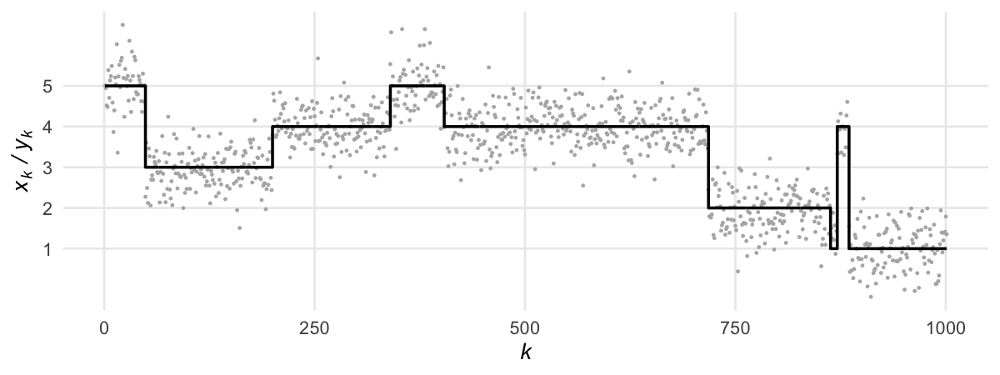
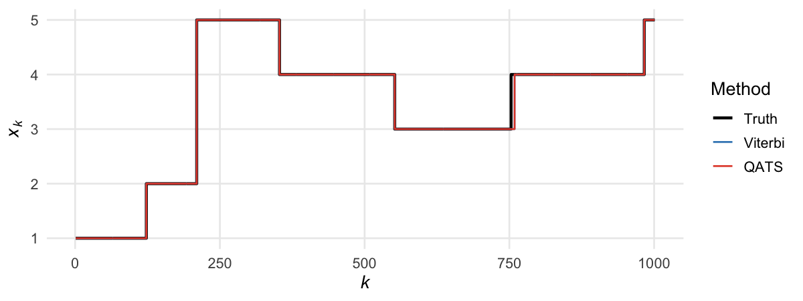
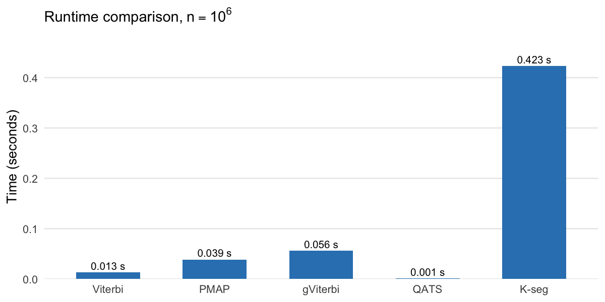
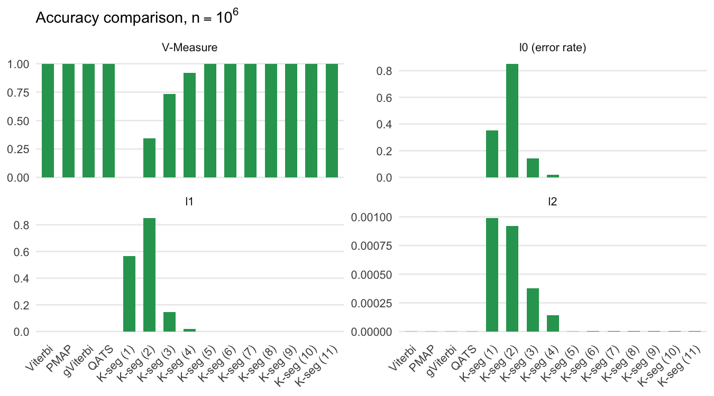

<!-- README.md is generated from README.Rmd. Please edit that file -->

# QATS

<!-- badges: start -->

<!-- badges: end -->

**QATS** (Quick Adaptive Ternary Segmentation) is an R package for
decoding hidden Markov models (HMMs) in polylogarithmic time in the
sequence length and cubic time in the number of states.

Classical decoders like the Viterbi algorithm run in $O(nm^2)$ time,
which becomes a bottleneck for long sequences. QATS achieves
$O(m^3 \log^2 n)$ complexity by combining a divide-and-conquer strategy
with an adaptive ternary segmentation step, making it orders of
magnitude faster on long sequences while producing near-identical
decoded paths.

> Moesching, A., Li, H. and Munk, A. (2025). Quick Adaptive Ternary
> Segmentation for decoding hidden Markov models. *Journal of
> Computational and Graphical Statistics*.
> [doi:10.1080/10618600.2025.2572328](https://doi.org/10.1080/10618600.2025.2572328)

The package also provides C++ implementations of the Viterbi algorithm,
pointwise MAP (PMAP), the generalized risk-based classifier of [Lember
and Koloydenko (2014)](https://dl.acm.org/doi/10.5555/2627435.2627436),
and the K-segmentation approach of [Titsias, Holmes and Yau
(2016)](https://doi.org/10.1080/01621459.2014.998762).

## Installation

Install from GitHub with:

``` r
# install.packages("devtools")
devtools::install_github("AlexandreMoesching/QATS")
```

## Quick start

``` r
library(QATS)
library(ggplot2)

theme_set(
  theme_minimal(base_size = 13) +
    theme(
      panel.grid.minor = element_blank(),
      plot.title = element_text(face = "bold", size = 14)
    )
)

set.seed(123)

# Model parameters
m <- 5                       # number of hidden states
mu <- 1:m                    # emission means
sigma <- rep(0.5, m)         # emission std devs
n <- 1e3 + 1                 # sequence length
K <- 7                       # expected number of change points

# Simulate an HMM
par <- sample.HMM(
  n = n, m = m, K = K,
  emi.dist = "normal",
  emi.param = list(mu = mu, sigma = sigma)
)
xx.0 <- par$xx
yy   <- par$yy

# Actual number of change points
sum(diff(xx.0) != 0)
#> [1] 6
```

`sample.HMM()` returns a parameter list containing the log-transition
matrix, log-initial distribution, emission (log-)densities, and their
cumulative sums. This list is passed directly to the decoding functions.

### Visualising the HMM

``` r
df <- data.frame(k = seq_len(n), y = yy, x = xx.0)

ggplot(df) +
  geom_point(aes(k, y), colour = "grey70", size = 0.3) +
  geom_step(aes(k, x), linewidth = 0.8) +
  scale_y_continuous(breaks = 1:m) +
  labs(x = expression(italic(k)), y = expression(italic(x[k] * " / " * y[k])))
```



### Decoding

``` r
vit  <- Viterbi.CPP(par)
pmap <- PMAP.CPP(par)
qats <- QATS.CPP(par)
```

``` r
df_paths <- data.frame(
  k = rep(seq_len(n), 3),
  x = c(xx.0, vit$xx, qats$xx),
  Method = factor(
    rep(c("Truth", "Viterbi", "QATS"), each = n),
    levels = c("Truth", "Viterbi", "QATS")
  )
)

ggplot(df_paths, aes(k, x, colour = Method, linewidth = Method)) +
  geom_step() +
  scale_colour_manual(values = c("Truth" = "black", "Viterbi" = "#3182bd", "QATS" = "#e34a33")) +
  scale_linewidth_manual(values = c("Truth" = 1, "Viterbi" = 0.6, "QATS" = 0.6)) +
  scale_y_continuous(breaks = 1:m) +
  labs(x = expression(italic(k)), y = expression(italic(x[k])))
```



All three decoders agree on this example:

``` r
c(Viterbi = sum(xx.0 != vit$xx),
  PMAP    = sum(xx.0 != pmap$xx),
  QATS    = sum(xx.0 != qats$xx))
#> Viterbi    PMAP    QATS 
#>       6       4       6
```

## Benchmark: all decoders on a long sequence

The advantage of QATS becomes clear on longer sequences. Below, we
decode a sequence of length $n = 10^6$ and compare runtime and accuracy.

``` r
n <- 1e6 + 1

par <- sample.HMM(
  n = n, m = m, K = K,
  emi.dist = "normal",
  emi.param = list(mu = mu, sigma = sigma)
)
xx.0 <- par$xx

# Collect results into a data frame
run <- function(name, xx_hat, time_s) {
  data.frame(
    Method     = name,
    time       = time_s,
    l0         = lp_norm(xx.0, xx_hat, 0),
    V_measure  = V_measure(xx.0, xx_hat)
  )
}

results <- rbind(
  {r <- Viterbi.CPP(par);       run("Viterbi",  r$xx, r$time)},
  {r <- PMAP.CPP(par);          run("PMAP",     r$xx, r$time)},
  {r <- G_classifier.CPP(par, 0, 1, 0, 1);
                                 run("gViterbi", r$xx, as.numeric(r$time))},
  {r <- QATS.CPP(par);          run("QATS",     r$xx, r$time)}
)

# K-segmentation (returns K_max paths)
K_max <- 11
r <- K_segmentation.CPP(par, K_max)
for (s in seq_len(K_max)) {
  results <- rbind(results, run(
    paste0("K-seg (", s, ")"),
    r$xx[s, ],
    as.numeric(r$time)
  ))
}

results$Method <- factor(results$Method, levels = results$Method)
```

### Runtime

``` r
# Highlight the main methods (not individual K-seg variants)
main <- results[!grepl("^K-seg \\(", results$Method) | results$Method == "K-seg (11)", ]
main$Method <- droplevels(main$Method)
levels(main$Method)[levels(main$Method) == "K-seg (11)"] <- "K-seg"

ggplot(main, aes(Method, time)) +
  geom_col(fill = "#3182bd", width = 0.6) +
  geom_text(aes(label = scales::number(time, accuracy = 0.001, suffix = " s")),
            vjust = -0.4, size = 3.5) +
  scale_y_continuous(expand = expansion(mult = c(0, 0.15))) +
  labs(x = NULL, y = "Time (seconds)",
       title = expression("Runtime comparison," ~ n == 10^6)) +
  theme(panel.grid.major.x = element_blank())
```



### Accuracy

``` r
ggplot(results, aes(Method, V_measure)) +
  geom_col(fill = "#2ca25f", width = 0.6) +
  geom_text(aes(label = sprintf("%.3f", V_measure)),
            vjust = -0.4, size = 3) +
  scale_y_continuous(limits = c(0, 1.1), breaks = seq(0, 1, 0.25)) +
  labs(x = NULL, y = "V-Measure",
       title = expression("Accuracy comparison," ~ n == 10^6)) +
  theme(panel.grid.major.x = element_blank(),
        axis.text.x = element_text(angle = 45, hjust = 1))
```



QATS matches Viterbi in accuracy while running significantly faster on
long sequences.

## Step-by-step visualisation of QATS

For small sequences ($n < 10^3$), `QATS.display()` provides an
interactive visualisation of each recursive step:

``` r
set.seed(1234)
n <- 3e2 + 1
par <- sample.HMM(
  n = n, m = m, K = K,
  emi.dist = "normal",
  emi.param = list(mu = mu, sigma = sigma)
)
res.Vit <- Viterbi.CPP(par)
res.QATS <- QATS.display(par$xx, res.Vit$xx, par)
```

## Homogeneity assumption

QATS targets the homogeneous HMM decoding problem: the transition matrix
$\boldsymbol{p}$ is fixed over time. However, the emission distributions
may vary freely across time steps – the implementation only requires
cumulative sums of the log-emission densities.

For a fully non-homogeneous HMM where $\boldsymbol{p}^{(k)}$ changes
with $k$, one can replace each use of the static $\boldsymbol{p}$ with
the time-indexed $\boldsymbol{p}^{(k)}$ when computing transition
log-probabilities, at no additional computational cost.

## Citation

If you use QATS in your research, please cite:

    @article{moesching2025qats,
      author  = {Moesching, Alexandre and Li, Housen and Munk, Axel},
      title   = {Quick Adaptive Ternary Segmentation for Decoding Hidden {Markov} Models},
      journal = {Journal of Computational and Graphical Statistics},
      year    = {2025},
      doi     = {10.1080/10618600.2025.2572328}
    }
